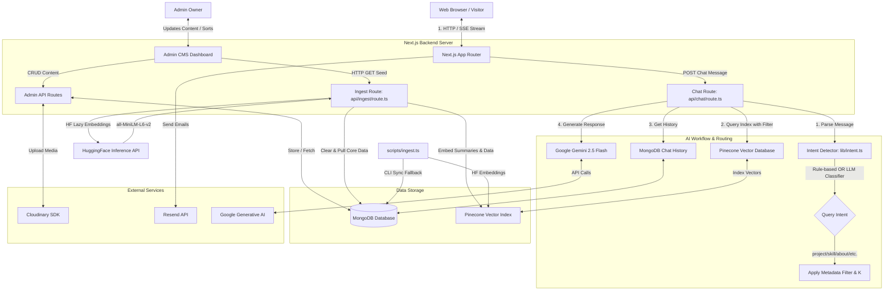

# ⚡ AI-Powered Developer Portfolio & Admin CMS


A modern, high-performance developer portfolio website integrated with a secure administrative Content Management System (CMS) and a production-grade AI chat assistant. Built using **Next.js**, **Tailwind CSS 4**, and **MongoDB**, the platform features smooth 3D elements, dynamic drag-and-drop reordering, and a vector-backed RAG (Retrieval-Augmented Generation) pipeline for context-aware portfolio assistance.

---

## 📑 Table of Contents

- [✨ Features](#-features)
- [🏗️ System Design Architecture](#-system-design-architecture)
- [🔄 Application Workflows](#-application-workflows)
- [🛠️ Tech Stack](#-tech-stack)
- [📂 Project Structure](#-project-structure)
- [🚀 Getting Started](#-getting-started)
- [🔮 Future Roadmap: AI Agent + MCP](#-future-roadmap-ai-agent--mcp)
- [🤝 Contributing](#-contributing)

---

## ✨ Features

### 👤 Public User Experience
- **🎨 Modern & Responsive Design**: Styled using **Tailwind CSS 4** and **Shadcn/ui** for fluid, responsive layouts optimized for all screens.
- **✨ Immersive Visuals**: Fluid animations powered by **Framer Motion** and responsive 3D elements utilizing **Three.js** (`@react-three/fiber` and `@react-three/drei`).
- **🚀 Dynamic Content Showcase**: Projects, skills, intros, and certificates are served dynamically from a **MongoDB** database.
- **🤖 Intelligent AI Assistant**: A floating interactive chat widget that:
  - **Hybrid Intent Detection**: Detects user query intent (Fast Path: rule-based keywords | Slow Path: Gemini 2.5 Flash semantic classification) to filter out greetings, projects, skills, contact info, bio, or general chats.
  - **Dynamic Metadata Filtering**: Uses query intent to filter Pinecone search results by category (`project`, `skill`, `contact`, etc.) and dynamically adjusts search depth (`k`) for summaries vs. specific items.
  - **Real-Time Streaming**: Streams answers token-by-token with support for mid-stream cancellation via `AbortController`.
  - **Persistent Session Memory**: Persists conversation context and history per session directly in MongoDB.
  - **Anti-Hallucination Guardrails**: Employs strict system prompts ensuring answers are grounded only in verified portfolio context.
- **📧 Seamless Contact Form**: Direct email notifications using the **Resend API**.

### 🛡️ Admin CMS Capabilities
- **🔐 Secure Authentication**: Protected dashboard routes utilizing **NextAuth.js**.
- **📊 Comprehensive CRUD Dashboards**: Complete management interface for updating introduction texts, project entries, skill sets, blogs, and certificates.
- **✋ Drag & Drop Reordering**: Intuitive sorting of skills and projects powered by `@dnd-kit`.
- **☁️ Cloud-Based Media Management**: Seamless image uploads and background cleanup using the **Cloudinary SDK**.
- **⚡ Web-Based Vector Ingestion**: Rebuild, purge, and seed the Pinecone vector index dynamically via `/api/ingest` HTTP GET requests.

---

## 🏗️ System Design Architecture

The project is structured around an intent-routed search model where client queries are classified before performing Pinecone queries:



---

## 🔄 Application Workflows

### 1. Ingestion / Search Indexing Workflow
To make the AI Chat Assistant knowledgeable, project metadata must be embedded and indexed:
1. **CMS Update**: The admin updates or adds content in the Admin dashboard.
2. **Database Sync**: The data is persisted in **MongoDB**.
3. **Index Generation & Seeding**:
   - **Method A (HTTP Web Ingestion)**: The admin requests the `/api/ingest` endpoint. The route validates or builds the Pinecone index, clears old data to prevent stale duplicates, compiles MongoDB records into document chunks, generates embeddings using HuggingFace (`sentence-transformers/all-MiniLM-L6-v2`), and uploads them.
   - **Method B (CLI Script)**: The administrator runs `npx tsx scripts/ingest.ts` directly from the command line.
4. **Structured Summaries**: The ingestion process automatically injects pre-compiled overview documents (e.g., "Projects Overview & Summary" and "Skills Overview & Summary") to ensure aggregate count and listing queries return accurate stats.
5. **Static Contact Ingestion**: Embedded contact channels and social profiles are seeded as dedicated index documents for contact-intent queries.

### 2. Intent-Guided RAG Chat Response Workflow
When a visitor interacts with the floating AI Chat Widget:
1. **Message Dispatch**: The client sends the prompt along with a unique `sessionId` to `api/chat/route.ts`.
2. **Session Memory Retrieval**: The API fetches the last 10 chat messages associated with the `sessionId` from MongoDB to maintain conversation context.
3. **Intent Detection**: The message passes through a hybrid classifier:
   - **Fast Path**: Resolves greetings, contact information, identity, bios, skills, and projects instantly using keyword pre-filtering rules.
   - **Slow Path**: Falls back to calling **Gemini 2.5 Flash** as a zero-temperature semantic classifier to categorize the message.
4. **Dynamic Metadata Filtering**:
   - If the intent matches `project`, `skill`, `about`, `intro`, or `contact`, the API configures a Pinecone metadata filter targeting that specific document type.
   - The lookup depth `k` is adjusted dynamically: `k=8` for broad listing queries (like *"list all projects"*), `k=1` for single-document profile queries, and `k=3` for general similarity matching.
5. **Context Retrieval**: The API queries Pinecone using the lazy-loaded HuggingFace embeddings client with the calculated filter and `k`.
6. **Prompt Engineering & Grounding**: All pieces of data (retrieved Pinecone segments and chat history) are formatted into the LangChain system prompt template.
7. **LLM Chain & Streaming**: The prompt is processed by **Google Gemini 2.5 Flash**, and the response is streamed back to the client using Server-Sent Events (SSE). The assistant response is saved back to MongoDB upon completion.

---

## 🛠️ Tech Stack

| Layer | Technologies |
| :--- | :--- |
| **Frontend** | [Next.js 15/16](https://nextjs.org/) (App Router), [React 19](https://react.dev/), [Tailwind CSS 4](https://tailwindcss.com/), [Framer Motion](https://www.framer.com/motion/), [Three.js](https://threejs.org/) (`@react-three/fiber`), [Shadcn/ui](https://ui.shadcn.com/) |
| **Backend** | Next.js Route Handlers, [NextAuth.js](https://next-auth.js.org/) (Security), [MongoDB](https://www.mongodb.com/) (Database), [Mongoose](https://mongoosejs.com/) (ODM) |
| **AI & RAG** | [LangChain.js](https://js.langchain.com/) (Chains & Orchestration), [Pinecone](https://www.pinecone.io/) (Vector Database), [Google Gemini 2.5 Flash](https://ai.google.dev/) (LLM), [HuggingFace Inference API](https://huggingface.co/) (`all-MiniLM-L6-v2` embeddings) |
| **Services & Tools**| [Cloudinary](https://cloudinary.com/) (Image hosting), [Resend](https://resend.com/) (Emailing), [@dnd-kit](https://dndkit.com/) (Drag-and-drop sorting), ESLint, TSX |

---

## 📂 Project Structure

```bash
src/
├── app/
│   ├── (admin)/       # Protected admin routes (Dashboard, Project & Skill CMS)
│   ├── (main)/        # Public facing routes (Home, Projects list, Contact form)
│   ├── api/
│   │   ├── chat/      # AI Chat endpoint (hybrid RAG with Intent Routing & SSE streaming)
│   │   ├── ingest/    # HTTP Vector Store synchronization endpoint (Clear -> Seed Index)
│   │   └── ...        # Next.js API Routes (auth, projects, skills, email, upload)
│   ├── globals.css    # Global CSS definitions & variables
│   └── layout.tsx     # Root App Router Layout
├── components/
│   ├── GlobalChatWidget.tsx # Floating AI chat sidebar/widget
│   ├── MarkdownRender.tsx   # Custom markdown parser for streamed response output
│   └── ...                  # Reusable UI parts (Shadcn/custom)
├── hooks/             # Custom React state/utility hooks
├── types/             # TypeScript interfaces
└── middleware.ts      # Auth interceptor middleware

lib/                   # Backend utilities
├── db.ts              # Mongoose DB connector
├── auth.ts            # NextAuth Configuration
├── prompt.ts          # System prompt template with anti-hallucination instructions
├── memory.ts          # Persistent chat history handlers
├── intent.ts          # Hybrid Intent Classifier (Rule-based + LLM Fallback)
├── embeddings.ts      # Lazy-loaded HuggingFace embed client wrapper
├── vectorStore.ts     # Pinecone DB vector retriever wrappers (with metadata filters)
├── pinecone.ts        # Pinecone Client initialization & index checker
└── delete-image.ts    # Cloudinary asset purge helper

models/                # Mongoose Models
├── user.model.ts      # Admin User accounts
├── intro.model.ts     # Title, short description and key details
├── about.model.ts     # Detailed bio text
├── skill.model.ts     # Tech skills tagged with categories
├── project.model.ts   # Featured projects with links and tags
├── certificate.model.ts # Course completion credentials
├── chatMessage.model.ts # Persisted chat conversation sessions
└── blog.model.ts      # Custom blog posts

scripts/
└── ingest.ts          # Data sync CLI pipeline (MongoDB -> HuggingFace -> Pinecone Store)
```

---

## 🚀 Getting Started

Follow these steps to spin up the codebase in your local development environment.

### Prerequisites
- Node.js (v18.x or higher)
- MongoDB Database Instance (Local or MongoDB Atlas)
- Pinecone Index (Vector Dimension: 384 for `all-MiniLM-L6-v2`)

### 1. Clone & Install
```bash
git clone https://github.com/your-username/your-repository-name.git
cd your-repository-name
npm install
```

### 2. Configure Environment Variables
Create a `.env` file in the root directory and configure it as follows:

```env
# MongoDB Connection
MONGODB_URI="your_mongodb_connection_string"

# NextAuth Configuration
NEXTAUTH_URL="http://localhost:3000"
NEXTAUTH_SECRET="your_nextauth_secret_hash" # Generate using: openssl rand -base64 32

# Cloudinary Integration (Image Uploads)
CLOUDINARY_CLOUD_NAME="your_cloudinary_cloud_name"
CLOUDINARY_API_KEY="your_cloudinary_api_key"
CLOUDINARY_API_SECRET="your_cloudinary_api_secret"

# Resend API (Contact Form Emailer)
RESEND_API_KEY="your_resend_api_key"

# Base URL Configuration
NEXT_PUBLIC_BASE_URL="http://localhost:3000"

# AI Model Keys (Google Gemini)
GOOGLE_API_KEY="your_google_api_key"

# Pinecone Credentials
PINECONE_API_KEY="your_pinecone_api_key"
PINECONE_INDEX_NAME="portfolio-ai"

# HuggingFace Credentials (For Embeddings Generation)
HUGGINGFACE_API_KEY="your_huggingface_api_key"
```

### 3. Run Ingestion / Vector Seeding
To index your database content into the Pinecone vector database, choose one of the following methods:

* **Method A (Web Route)**: Run the server (`npm run dev`) and visit:
  ```
  http://localhost:3000/api/ingest
  ```
  This will dynamically build/reset the Pinecone index and seed the data, outputting JSON stats upon completion.

* **Method B (CLI Command)**: Run the ingestion script directly:
  ```bash
  npx tsx scripts/ingest.ts
  ```

### 4. Boot Dev Server
```bash
npm run dev
```
Open [http://localhost:3000](http://localhost:3000) inside your browser to inspect the result.

---

## 🔮 Future Roadmap: AI Agent + MCP

> [!NOTE]
> The current system leverages a static **Retrieval-Augmented Generation (RAG)** pipeline. While effective for simple question-answering, it lacks active tool execution, multi-step planning, and dynamic contextual awareness.

In the next phase of development, this workflow will be migrated to an autonomous **AI Agent + Model Context Protocol (MCP)** architecture:

```
┌────────────────────────────────────────────────────────┐
│                   Future Agent UI                      │
└──────────────────────────┬─────────────────────────────┘
                           │ User Prompts / Tasks
                           ▼
┌────────────────────────────────────────────────────────┐
│                Autonomous AI Agent                     │
│ (Planning Loop, Tool Call Parsing, State Management)  │
└──────────────────────────┬─────────────────────────────┘
                           │ MCP JSON-RPC Protocol
                           ▼
┌────────────────────────────────────────────────────────┐
│                   MCP Router / Hub                     │
└─────┬────────────────────┬────────────────────┬────────┘
      │                    │                    │
      ▼                    ▼                    ▼
┌───────────┐        ┌───────────┐        ┌───────────┐
│ MongoDB   │        │ Filesystem│        │ Git /     │
│ MCP Server│        │ MCP Server│        │ API Server│
└───────────┘        └───────────┘        └───────────┘
```

### 🎯 Key Migrations & Goals
1. **Dynamic Tool Calling**:
   Instead of injecting static text from the DB and vector search blindly into a single prompt, the LLM will act as an **AI Agent**. It will decide dynamically which tools to execute based on what the user asks (e.g., calling `query_projects_by_category` or `fetch_recent_blogs`).
2. **Integrating Model Context Protocol (MCP)**:
   - **MCP** is an open standard that enables LLMs to access data sources and tools securely.
   - We will deploy custom **MCP Servers** connected directly to the codebase's subsystems:
     - **Database MCP Server**: Exposes secure read/write queries to MongoDB for real-time querying without manual pipeline code in our API routes.
     - **Filesystem MCP Server**: Allows the agent to inspect project documentation, assets, or markdown files directly.
     - **GitHub MCP Server**: Fetches live commit histories, repository statistics, and star counts dynamically during chat.
3. **Expanded Agentic Actions**:
   The agent will gain the ability to perform complex workflows. Examples:
   - *“Schedule a meeting with me next Monday”* -> Agent triggers a Calendly/Google Calendar MCP tool.
   - *“Add a new project from this description”* -> Agent runs validation tools and invokes the DB MCP Server to write the entry directly (with admin approval).
   - *“Build a custom resume PDF highlighting my React experience”* -> Agent compiles a custom resume using styling templates and exports it.

---

## 🤝 Contributing

Contributions make the open-source community an amazing place to learn, inspire, and create. Any contributions you make are **greatly appreciated**.

1. Fork the Project.
2. Create your Feature Branch (`git checkout -b feature/AmazingFeature`).
3. Commit your Changes (`git commit -m 'Add some AmazingFeature'`).
4. Push to the Branch (`git push origin feature/AmazingFeature`).
5. Open a Pull Request.
